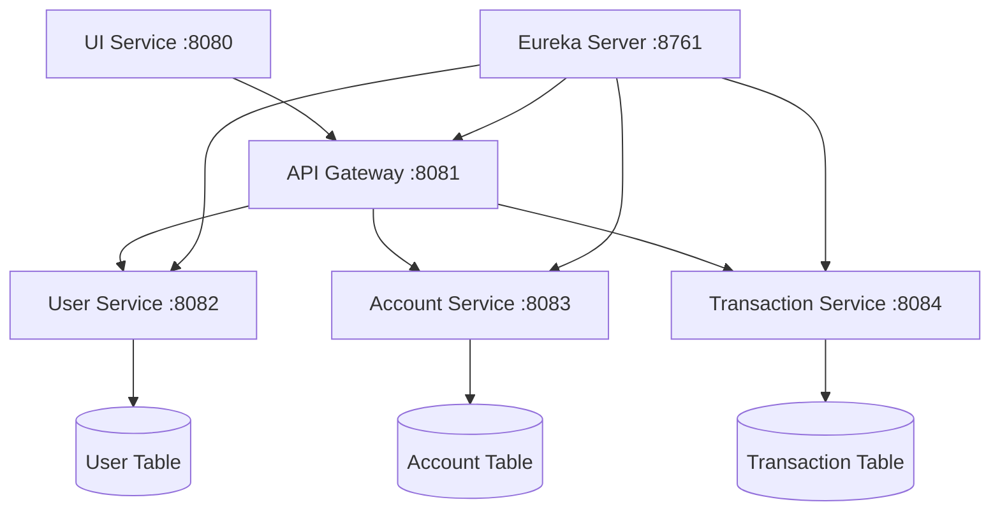

# 🏦 Online Banking Portal

<div align="center">
  
  
  
  
  
  
</div>

<div align="center">
  <h3>A modern, secure, and scalable banking portal built with Spring Boot microservices architecture</h3>
</div>

---

## 🌟 Overview

This is a comprehensive online banking portal developed as a college project to demonstrate modern microservices architecture principles. The application provides a full-featured banking experience with user management, account operations, and transaction processing, all built using Spring Boot and Spring Cloud technologies.

## ✨ Features

### 🔐 User Management
- **User Registration & Authentication** - Secure user signup and login
- **Profile Management** - Update personal information and preferences
- **Session Management** - Secure session handling and logout

### 🏧 Account Operations
- **Account Creation** - Create new bank accounts
- **Account Details** - View account information and balance
- **Multi-Account Support** - Manage multiple accounts per user

### 💰 Transaction Services
- **Money Transfers** - Transfer funds between accounts
- **Transfer to Bank Account** - Transfer money to external bank accounts
- **Transaction History** - Comprehensive transaction statements
- **Real-time Balance Updates** - Instant balance reflection

### 🎨 User Interface
- **Responsive Design** - Works on desktop and mobile devices
- **Intuitive Navigation** - Easy-to-use interface
- **Real-time Updates** - Dynamic content updates

## 🏗️ Architecture

### Microservices Design
The application follows a microservices architecture pattern with the following components:



### 📦 Service Modules

| Service | Port | Description |
|---------|------|-------------|
| **Eureka Server** | 8761 | Service registry and discovery |
| **API Gateway** | 8081 | Request routing and load balancing |
| **User Service** | 8082 | User authentication and management |
| **Account Service** | 8083 | Account operations and balance management |
| **Transaction Service** | 8084 | Transaction processing and history |
| **UI Service** | 8080 | Frontend interface and controllers |

## 🛠️ Technology Stack

### Backend
- **Java 11+** - Programming language
- **Spring Boot** - Application framework
- **Spring Cloud** - Microservices framework
  - **Eureka** - Service discovery
  - **Gateway** - API gateway
- **Spring Security** - Authentication and authorization
- **Spring Data JPA** - Data persistence
- **Circuit Breaker** - Fault tolerance and resilience
- **Maven** - Build and dependency management

### Frontend
- **Thymeleaf** - Template engine
- **HTML5 & CSS3** - Markup and styling
- **JavaScript** - Client-side functionality
- **Bootstrap** - Responsive design framework

### Database
- **H2 Database** - In-memory database (default)
- **MySQL/PostgreSQL** - Production database options

## 🚀 Quick Start

### Prerequisites
- ☕ Java JDK 11 or higher
- 📦 Maven 3.6+
- 🌐 Git

### Installation

1. **Clone the repository**
   ```bash
   git clone https://github.com/KrishnaSaxena108/Online-Banking-Portal.git
   cd Online-Banking-Portal
   ```

2. **Build all modules**
   ```bash
   mvn clean install
   ```

3. **Start services in order**
   
   **Step 1: Start Eureka Server**
   ```bash
   cd eureka-server
   mvn spring-boot:run
   ```
   
   **Step 2: Start API Gateway**
   ```bash
   cd ../api-gateway
   mvn spring-boot:run
   ```
   
   **Step 3: Start Backend Services**
   ```bash
   # Terminal 1
   cd ../user-service
   mvn spring-boot:run
   
   # Terminal 2
   cd ../account-service
   mvn spring-boot:run
   
   # Terminal 3
   cd ../transaction-service
   mvn spring-boot:run
   ```
   
   **Step 4: Start UI Service**
   ```bash
   cd ../ui-service
   mvn spring-boot:run
   ```

4. **Access the application**
   - 🌐 Main Application: http://localhost:8080
   - 📊 Eureka Dashboard: http://localhost:8761
   - 🔗 API Gateway: http://localhost:8081

## 📱 Usage Guide

### Getting Started
1. **Register** a new account or login with existing credentials
2. **Create** your first bank account
3. **Deposit** initial funds (simulation)
4. **Transfer** money between accounts
5. **View** transaction history and account statements

### Sample Workflow
```
Register User → Login → Create Account → View Balance → 
Transfer Funds → Check Transaction History → Logout
```

## 📁 Project Structure

```
Online-Banking-Portal/
├── 📁 eureka-server/              # Service registry
│   ├── src/main/java/
│   └── pom.xml
├── 📁 api-gateway/                # API gateway service
│   ├── src/main/java/
│   └── pom.xml
├── 📁 user-service/               # User management
│   ├── src/main/java/
│   └── pom.xml
├── 📁 account-service/            # Account operations
│   ├── src/main/java/
│   └── pom.xml
├── 📁 transaction-service/        # Transaction processing
│   ├── src/main/java/
│   └── pom.xml
├── 📁 ui-service/                 # Frontend interface
│   ├── src/main/java/
│   ├── src/main/resources/templates/
│   └── pom.xml
├── 📄 pom.xml                     # Parent POM
├── 📄 README.md
└── 📄 .gitignore
```

## ⚙️ Configuration

### Database Configuration
Update `application.properties` in each service:

```properties
# H2 Database (Default)
spring.datasource.url=jdbc:h2:mem:testdb
spring.datasource.username=sa
spring.datasource.password=

# MySQL Example
spring.datasource.url=jdbc:mysql://localhost:3306/banking_db
spring.datasource.username=your_username
spring.datasource.password=your_password
```

### Service Ports
Default port configuration:
- Eureka Server: 8761
- API Gateway: 8081
- User Service: 8082
- Account Service: 8083
- Transaction Service: 8084
- UI Service: 8080

## 🔒 Security Features

- **Session-based Authentication** - Secure user authentication and session management
- **Role-based Authorization** - Secure access control
- **Input Validation** - Protection against malicious inputs
- **HTTPS Support** - Secure communication (configurable)

## 🛡️ Resilience Features

- **Circuit Breaker Pattern** - Prevents cascade failures across microservices
- **Fault Tolerance** - Graceful handling of service unavailability
- **Service Recovery** - Automatic recovery mechanisms for failed services

## 🚧 Future Enhancements

- [ ] Two-factor authentication (2FA)
- [ ] Bill payment functionality
- [ ] Loan management system
- [ ] Docker containerization
- [ ] API documentation (Swagger/OpenAPI)
- [ ] Comprehensive testing suite

## 🤝 Contributing

Contributions are welcome! Please feel free to submit a Pull Request.

1. Fork the project
2. Create your feature branch (`git checkout -b feature/AmazingFeature`)
3. Commit your changes (`git commit -m 'Add some AmazingFeature'`)
4. Push to the branch (`git push origin feature/AmazingFeature`)
5. Open a Pull Request

## 👥 Development Team

<div align="center">

|  |  |  |  |
|:---:|:---:|:---:|:---:|
| **🚀 Lead Developer** | **🏗️ Project Architect** | **🎨 Frontend Developer** | **💻 Frontend Developer** |
| **Krishna Saxena** | **Spydiecy** | **JollyAnsh** | **Armaan Thind** |
| [@KrishnaSaxena108](https://github.com/KrishnaSaxena108) | [@spydiecy](https://github.com/spydiecy) | [@JollyAnsh](https://github.com/JollyAnsh) | [@Armaan25Thind](https://github.com/Armaan25Thind) |
| Project leadership, backend development, microservices architecture | System design, database architecture, service integration | UI/UX design, frontend implementation, responsive design | Frontend development, user experience, client-side functionality |

</div>

*This project was developed as a collaborative college assignment to demonstrate modern microservices architecture and teamwork in software development.*

## 🙏 Acknowledgments

- Thanks to the Spring Boot community for excellent documentation
- Inspired by modern banking applications
- Built as part of college curriculum to demonstrate microservices architecture

---

<div align="center">
  <p>⭐ If you found this project helpful, please give it a star!</p>
  <p>Made with ❤️ by Krishna Saxena and team</p>
</div>
